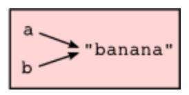

# Everything is Object - A quick dive into mutable and immutable objects in Python

---

## Introduction - What is an object?

Put simply, an object in Python is any piece of data that gets saved. These include strings, integers, functions and even modules.

These objects have 3 main characteristics:
. id - objects memory address
. Type - what the object represents (int, str, etc)
. Value - The data stored in the object which can be mutable or immutable

An instance is similar to an object but where an object relates to an entity in the memory, and instance the relationship between an object and its class

### Mutable and immutable

A **mutable object** is one which can be altered after creation. These include lists, dictionaries and sets. The memory address stays the same when altered and they are unhashable.

**Immutable objects** cannot be altered after they are created. They can only be changed by essentially creating a new object. These include integers, floats, strings, tuples and booleans. The memory address changes when the onject is reassigned which makes it immutable, and they can be hashed.

---

## Type and ID

To return the type of an object, you can use something like:
```python
>>> a = 8
>>> type(a)
<class 'int'>
```

and to return the memory address (id) you can do:
```python
>>> id(a)
4521921040
```

---

## Immutable objects

### Int
say we have 2 integers, a and b. Let `a = 89` and `b = 89`.

a and b both **point** to the same object. If we said `b = a` then they still point to the same object. However, if we then said `b = a + 1`, they no longer do as integers are **immutable**. The value of `b` has been altered so it no longer points to the same object.

### Str

The same will happen with strings, another immutabale object. If we say:
```python
>>> s1 = "banana"
>>> s2 = s1
>>> print(s2 is s1)
True
```
The 2 strings both point to the same object of `banana` to save memory. 2 strings with identical values will point to the same object.



Buuuuuut if we did:
```python
>>> s1 = "banana"
>>> s2 = "banana"
>>> print(s1 == s2)
True
>>> print (s1 is s2)
False
```
As they have the same value, the the `is` keyword points to the objects address which are not the same, but the `==` just compares values.

## Mutable objects

### Lists
This is the same way that if we used a **mutable** object, a list:
```python
>>> l1 = [1, 2, 3]
>>> l2 = [1, 2, 3]
>>> print(l1 == l2)
True
>>> print(l1 is l2)
False
```
Different addresses stored on creation, but if we said:
```python
>>> l1 = [1, 2, 3]
>>> l2 = l1
>>> print(l1 is l2)
True
```
due to the memery address allocation on creation :) THis is called **aliasing**

---

Because these objects are mutable, they can be altered. So if we let `l2 = l1` and `l1.append(4)`, this will update `l2` as well, the memory address stays the same when changed.

But if we dont append and just add, then this doesnt make it the same
```python
l1 = [1, 2, 3]
l2 = l1
l1 = l1 + [4]
print(l2)
[1, 2, 3]
```
Which i think is stupid but hey ho
